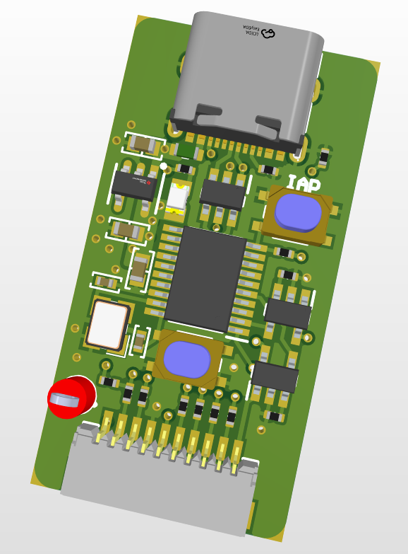
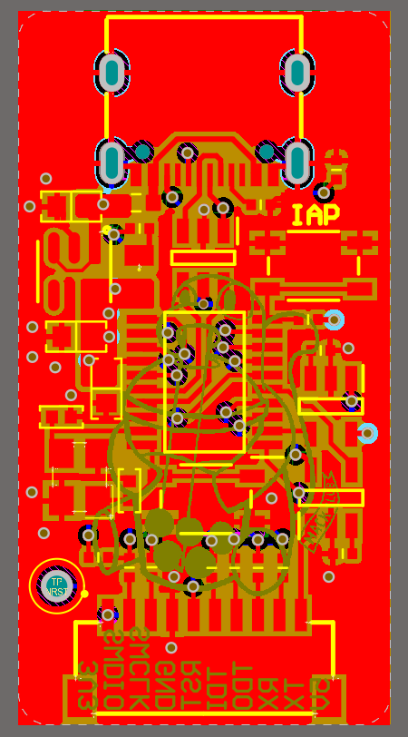
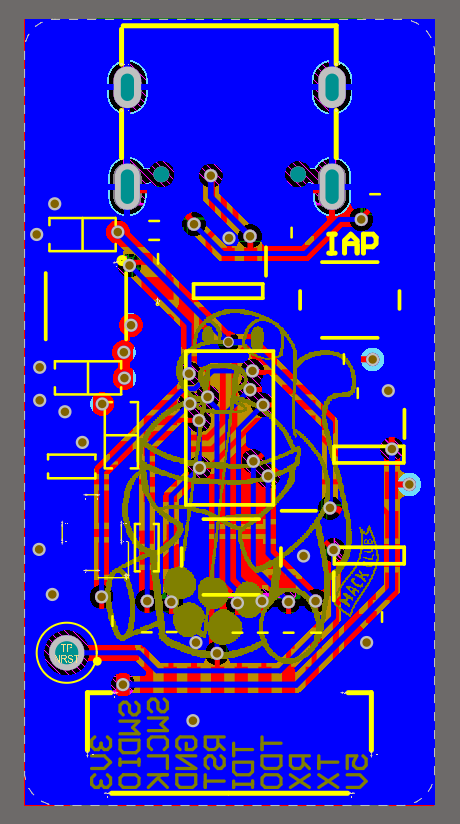

# WCH-LinkE

A compact USB-C clone of WCH's [WCH-LinkE](https://www.wch.cn/products/WCH-Link.html) debugger, designed in Altium. It programs and debugs WCH RISC-V MCUs over SWD, can be switched into DAPLink / ARM SWD mode, and has a USB-UART.

This is my own version, on a 4-layer PCB meant to be cheap to manufacture at JLCPCB, with more specific features.

Production files (Gerbers, drill, BOM) are in [`outputs/`](outputs/). Design files are in [`pcb/`](pcb/).

## Why this exists

I wanted an excuse to use Altium so I made this, which I consider to be a relatively simple board. The schematic follows the same overall design as existing OSHWHub clones ([fanhuacloud](https://web.archive.org/web/20240525210835/https://oshwhub.com/fanhuacloud/wch-linke/), with a CH32V305FBP6 as the LinkE MCU. As a bonus, the same chip can run [high-speed ARM DAPLink firmware](https://github.com/prosper00/CH32V305-DAPLink-HS).

## Pictures




*Full 3D model of the board.*


*Schematic.*



*PCB layout front*



*PCB layout back*

## Connections

The only cable is the target debug lead: a 10-pin JST-SH to Dupont harness.

The header pinout was copied so a stock **WeAct Studio Mini Debugger (ST-Link)** or **WeAct Logic Analyzer** JST-SH-to-Dupont cable is mostly colour-compatible.

Pin functions are also silkscreened on the board, next to the connector:

| Pin | Function |
| ---: | --- |
| 1 | 3V3 |
| 2 | SWDIO / TMS |
| 3 | SWCLK / TCK |
| 4 | GND |
| 5 | RST |
| 6 | TDI |
| 7 | TDO |
| 8 | RX |
| 9 | TX |
| 10 | 5V |

Buttons:

- **IAP** - hold while plugging in USB to enter IAP / bootloader mode
- **Mode** - hold while plugging in USB to switch RV (WCH) vs DAPLink mode

## How to flash

The CH32V305 needs WCH-LinkE firmware (or DAPLink, if you want ARM). Two options:

### Another WCH-LinkE

Use a working LinkE (or any WCH programmer) to flash `FIRMWARE_CH32V305.bin` onto this board over SWD, the same way you would program any other CH32V305.

### IAP, no second debugger

[wlink-iap](https://github.com/cjacker/wlink-iap) can upgrade / downgrade LinkE firmware over USB without holding the IAP button or buying a second dongle. Follow the instructions in that repo. Short version:

```
git clone https://github.com/cjacker/wlink-iap
cd wlink-iap
make
sudo make install

wlink-iap -f FIRMWARE_CH32V305.bin
```

For a full chip erase / APP+IAP image, enter IAP first (`wlink-iap -i`, or hold **IAP** while plugging in USB) and then follow the [wlink-iap](https://github.com/cjacker/wlink-iap) notes.

To leave IAP if you entered it by accident: `wlink-iap -q`.

After the stock LinkE firmware is on the board, use [WCH-LinkUtility](https://www.wch.cn/downloads/WCH-LinkUtility_ZIP.html) or MounRiver Studio to switch RV vs DAP mode.

## Known issues

- A few silkscreen-to-exposed-copper DRC errors were left as-is; they are cosmetic.
- Vias are tented. Altium's solder-mask sliver rule complains about vias close to exposed copper.


## Bill of materials

Prices are rough LCSC small-qty estimates (Aug 2026) and will move. They do not include PCB, assembly, shipping, or the JST-SH cable.

| Designator | Value | Footprint | Qty | LCSC | Unit cost (est.) | Line total (est.) |
| --- | --- | --- | ---: | --- | ---: | ---: |
| C1, C4, C5 | 1 µF | 0603 | 3 | [C126631](https://www.lcsc.com/product-detail/C126631.html) | $0.08 | $0.23 |
| C2, C3 | 30 pF | 0402 | 2 | [C526980](https://www.lcsc.com/product-detail/C526980.html) | $0.005 | $0.01 |
| D1 | Green LED | 0805 | 1 | [C84256](https://www.lcsc.com/product-detail/C84256.html) | $0.01 | $0.01 |
| F1 | 500 mA PTC | 0603 | 1 | [C7472536](https://www.lcsc.com/product-detail/C7472536.html) | $0.04 | $0.04 |
| J1 | 10-pin JST-SH | SMD 1 mm | 1 | [C5340780](https://www.lcsc.com/product-detail/C5340780.html) | $0.07 | $0.07 |
| J2 | USB-C 16P | SMD | 1 | [C165948](https://www.lcsc.com/product-detail/C165948.html) | $0.19 | $0.19 |
| R1, R2 | 330 Ω | 0402 | 2 | [C25104](https://www.lcsc.com/product-detail/C25104.html) | $0.007 | $0.014 |
| R3, R6, R7 | 1 kΩ | 0402 | 3 | [C11702](https://www.lcsc.com/product-detail/C11702.html) | $0.007 | $0.021 |
| R4, R5, R13, R14 | 100 Ω | 0402 | 4 | [C25076](https://www.lcsc.com/product-detail/C25076.html) | $0.008 | $0.032 |
| R8 | 16 kΩ | 0402 | 1 | [C25759](https://www.lcsc.com/product-detail/C25759.html) | $0.016 | $0.016 |
| R9 | 22 kΩ | 0402 | 1 | [C25768](https://www.lcsc.com/product-detail/C25768.html) | $0.006 | $0.006 |
| R10, R12 | 5.1 kΩ | 0402 | 2 | [C25905](https://www.lcsc.com/product-detail/C25905.html) | $0.004 | $0.008 |
| SW1, SW2 | Tactile switch | SMD | 2 | [C5363473](https://www.lcsc.com/product-detail/C5363473.html) | $0.03 | $0.06 |
| TP1 | Test point | Through hole | 1 | [5000](https://www.digikey.com/en/products/detail/keystone-electronics/5000/301) | $0.25 | $0.25 |
| U1 | CH32V305FBP6 | TSSOP-20 | 1 | [C5123443](https://www.lcsc.com/product-detail/C5123443.html) | $1.90 | $1.90 |
| U2, U3 | SY6280AAC | SOT-23-5 | 2 | [C55136](https://www.lcsc.com/product-detail/C55136.html) | $0.10 | $0.19 |
| U4 | TPS7A2033PDBVR | SOT-23-5 | 1 | [C2862740](https://www.lcsc.com/product-detail/C2862740.html) | $0.24 | $0.24 |
| U5 | USBLC6-2SC6 | SOT-23-6 | 1 | [C2827654](https://www.lcsc.com/product-detail/C2827654.html) | $0.04 | $0.04 |
| Y1 | 12 MHz | 3225 | 1 | [C9002](https://www.lcsc.com/product-detail/C9002.html) | $0.10 | $0.10 |
| | | | | **Total (components only)** | | **~$3.43** |
